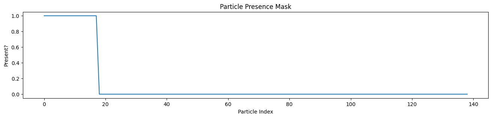
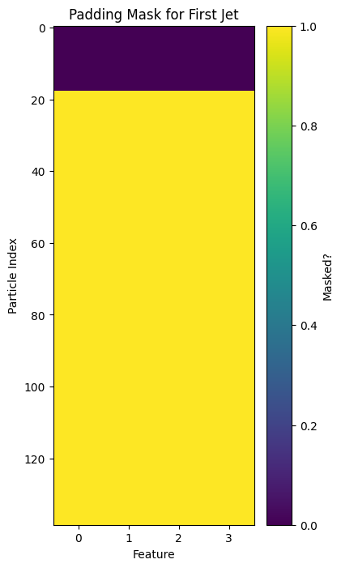
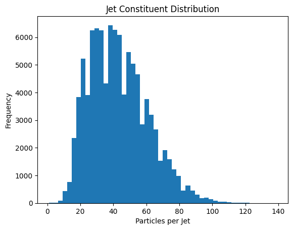

# Understanding Masking in NumPy using the QG Jet Dataset

## Overview

This project explores two powerful masking techniques provided by NumPy:

* **Boolean Masking**
* **NumPy Masked Arrays (`numpy.ma`)**

using the **Quark–Gluon (QG) Jet Dataset** from particle physics.

The primary goal is to understand how padding affects scientific datasets and how masking techniques can be used to identify and ignore padded entries while preserving physically meaningful information.

---

## Why Masking is Needed

In the QG Jet Dataset, different jets contain different numbers of particles.

Machine learning models typically require fixed-size inputs, so jets are stored using a fixed tensor shape:

```python
X.shape = (100000, 139, 4)
```

where:

* `100000` → Number of jets
* `139` → Maximum particle positions per jet
* `4` → Particle features (`pT`, `y`, `phi`, `pid`)

Jets containing fewer than 139 particles are padded with rows of zeros.

These padded entries do not correspond to real particles and must be handled carefully during analysis.

---

## Particle Presence Mask

A particle is considered valid if at least one of its features is non-zero.

Mathematically:

$$
\text{mask} = (X \neq 0).any(axis=1)
$$

where:

* `True` → Real particle
* `False` → Padding

This mask allows padded entries to be identified efficiently.

---

## Methods Explored

### 1. Boolean Masking

Boolean Masking physically removes padded particles:

```python
mask = (jet != 0).any(axis=1)
filtered_jet = jet[mask]
```

Characteristics:

* Removes padding completely
* Changes array shape
* Produces variable-length outputs
* Useful for particle-level analysis

---

### 2. NumPy Masked Arrays

Masked Arrays preserve the original tensor structure while hiding invalid values:

```python
import numpy.ma as ma

masked_jet = ma.masked_where(jet == 0, jet)
```

Characteristics:

* Preserves original shape
* Automatically ignores masked values during calculations
* Ideal for dataset-wide statistics
* Useful for fixed-size machine learning pipelines

---

## Key Results

* Successfully identified padded particles using Boolean Masking.
* Demonstrated how NumPy Masked Arrays preserve tensor structure while ignoring padding.
* Verified that both masking approaches produce identical physical results.
* Performed particle multiplicity analysis on **100,000 jets**.
* Investigated the impact of padding on mean transverse momentum (**pT**).

---

## Visualizations

### Particle Presence Mask



The particle presence mask identifies valid particles and distinguishes them from padded entries.

---

### Padding Mask



The padding mask highlights positions introduced solely for fixed-size tensor storage.

---

### Jet Constituent Distribution



Distribution of particle multiplicity across 100,000 jets in the QG Jet Dataset.

---

## Comparison

| Property                        | Boolean Masking | Masked Arrays        |
| ------------------------------- | --------------- | -------------------- |
| Removes padding                 | ✅ Yes           | ❌ No                 |
| Preserves shape                 | ❌ No            | ✅ Yes                |
| Variable-length outputs         | ✅ Yes           | ❌ No                 |
| Dataset-wide statistics         | Moderate        | Excellent            |
| Fixed-size tensor compatibility | ❌ No            | ✅ Yes                |
| Best use case                   | Data selection  | Statistical analysis |

---

## Technical Report

A detailed report explaining every step of the notebook is included in this repository.

The report contains:

* Dataset background
* Padding analysis
* Shape transformations
* Boolean Masking explanation
* Masked Array explanation
* Physics interpretation
* Dataset-wide analysis
* Complete result discussion

📄 **Report:** [NumPy_Masking_QG_Jets_Report.pdf](./NumPy_Masking_QG_Jets_Report.pdf)

---

## Dataset

The dataset used in this project was obtained from:

https://zenodo.org/records/3164691

Citation:

> Komiske, P. T., Metodiev, E. M., & Thaler, J. (2019). Energy Flow Networks: Deep Sets for Particle Jets.

---

## Repository Structure

```text
numpy-masking-qg-jets/
│
├── images/
│   ├── README.md
│   ├── multiplicity_histogram.png
│   ├── padding_mask.png
│   └── particle_presence_mask.png
│
├── NumPy_Masking_QG_Jets_Report.pdf
├── README.md
└── numpy_masking_qg_jet_dataset.ipynb
```

---

## Author

**Pratap Yadav**

KIIT University

LinkedIn:
https://www.linkedin.com/in/7hepratap/

GitHub:
https://github.com/7hepratapyadav

---
